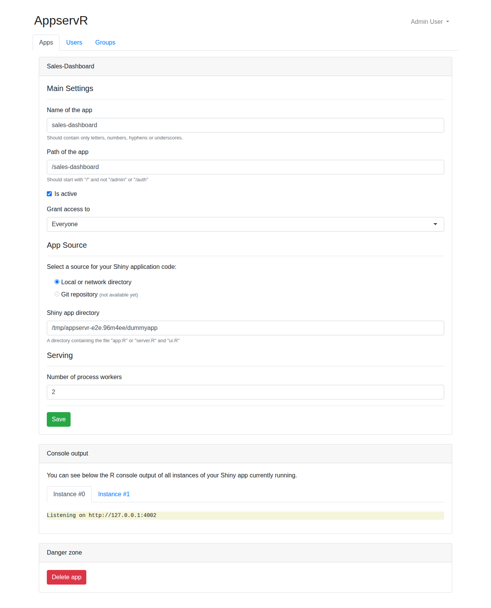

# Configure your first app

Once you're logged in as an admin, go to [http://localhost:8080/admin/apps](http://localhost:8080/admin/apps) and click **New App**. This walks through each field on that form.

## Main settings

* **Name of the app**: letters, numbers, hyphens, and underscores only. This is also the name shown on the apps list.
* **Path of the app**: where the app is served, for example `/sales-dashboard`. It must start with `/` and can't be `/admin` or `/auth`, since those are reserved for AppservR itself. Several apps can share the same server on different paths, including nested ones (`/` and `/sales-dashboard` and `/sales-dashboard/internal` can all coexist).
* **Is active**: unchecked apps are configured but not running, and won't use any of your R workers.
* **Grant access to**: who can reach the app once it's active.
    * **Everyone**: public, no login required.
    * **All authenticated users**: any user who signed up on this AppservR instance.
    * **Specific user groups**: pick from the groups you've created under the Groups tab.

## App source

AppservR currently only supports a **local or network directory** as an app's source: a path to a folder containing either `app.R`, or both `server.R` and `ui.R`. This can be a path on the machine AppservR runs on, or a network share it can read. A **Git repository** source is planned but not available yet, which is why that option is disabled in the form.

## Serving

**Number of process workers** sets how many separate `Rscript` processes AppservR keeps running for this app, side by side. A user session is bound to one worker for its whole duration, but a single worker serves multiple sessions at once: new sessions are routed to whichever running worker currently has the fewest connected users. Sharing workers this way is what makes AppservR resource-efficient — most apps don't need one process per user.

How many workers to configure depends less on how many users you expect and more on what the app actually does once someone's connected. R itself is single-threaded, so while a worker is busy computing something for one of its sessions, every other session sharing that worker has to wait its turn. For apps that respond quickly (most dashboards and interactive tools), a handful of sessions can comfortably share one worker. For apps with long-running CPU-bound operations in the main reactive context, and that don't use an async pattern (the `future`/`promises` packages) to run that work in the background, one slow computation blocks every other session on that worker, so you'll want a worker count closer to your expected number of concurrent users.

## After saving

Once saved, the app's own page shows the console output of each running worker, which is the first place to look if an app isn't starting (see the "Listening on" line below, confirming the worker actually started).

